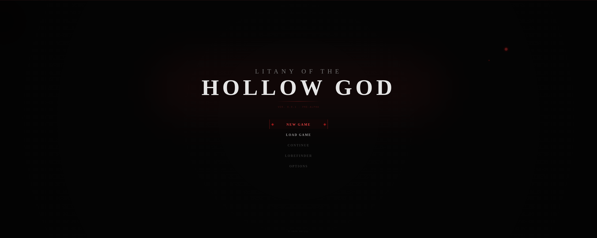
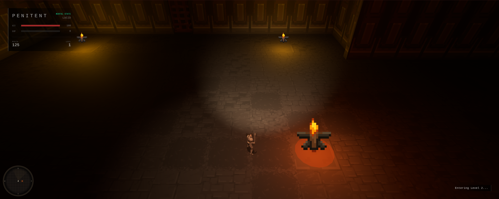
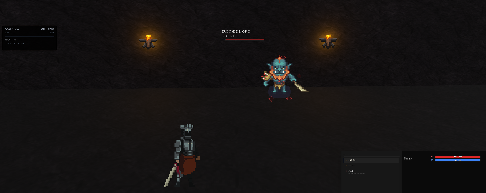
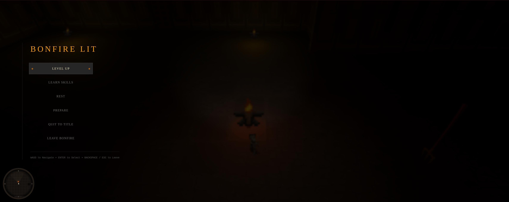
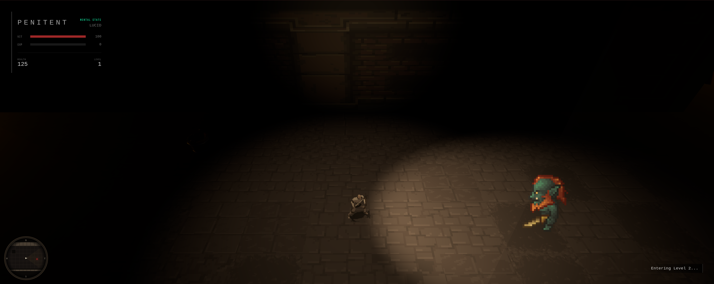
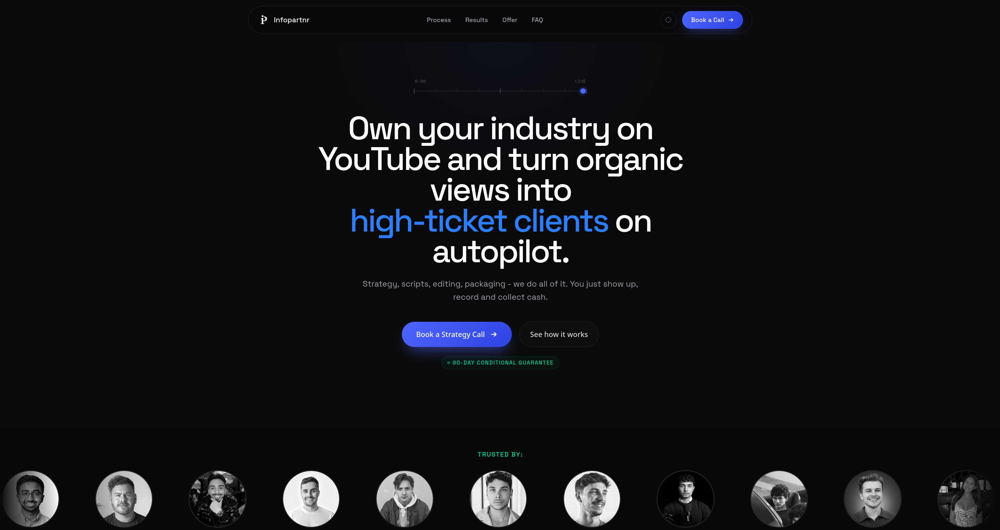
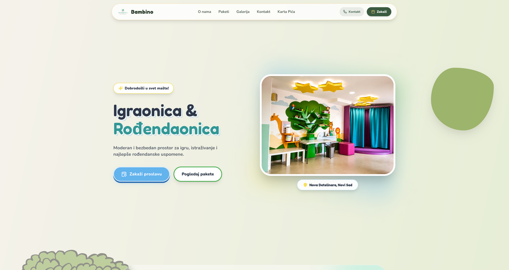

<!-- ============ HEADER ============ -->
<div align="center">


```text
██████╗ ███████╗██████╗  ██╗██╗██╗
██╔══██╗██╔════╝██╔══██╗███║██║██║
██████╔╝█████╗  ██████╔╝╚██║██║██║
██╔══██╗██╔══╝  ██╔══██╗ ██║██║██║
██████╔╝███████╗██║  ██║ ██║██║██║
╚═════╝ ╚══════╝╚═╝  ╚═╝ ╚═╝╚═╝╚═╝
>> SYSTEM.INIT... [OK]
>> USER: David Vujkovic // Digital Forger
```

<a href="https://github.com/ber1ii">
  
</a>

<br />


</div>

<!-- ============ LOG ============ -->

```yaml
LOG_ENTRY: Programming since age 14. Finalizing a degree in Applied Software Engineering.
MISSION:   Build software that is visually engaging and solves real problems.
PROTOCOL:  No templates. Architecture, logic, visuals and UX built from scratch.
```


## 🛰️ FEATURED SYSTEM // Litany of the Hollow God

<div align="center">

**A 2.5D horror RPG engine in the browser: real-time exploration, instanced turn-based combat, and a sanity-driven world.**

[](https://litany-of-the-hollow-god.vercel.app)
&nbsp;




<table>
  <tr>
    <td width="50%"></td>
    <td width="50%"></td>
  </tr>
  <tr>
    <td align="center"><sub><b>OVERWORLD</b> // torch-lit exploration, shader-faded walls</sub></td>
    <td align="center"><sub><b>COMBAT</b> // instanced turn-based encounters</sub></td>
  </tr>
  <tr>
    <td width="50%"></td>
    <td width="50%"></td>
  </tr>
  <tr>
    <td align="center"><sub><b>BONFIRE</b> // level up, learn skills, rest</sub></td>
    <td align="center"><sub><b>ENCOUNTER</b> // sprite enemies in a 3D space</sub></td>
  </tr>
</table>

</div>

### ⚡ Modules

- 🗺️ **ASCII-to-3D level generator** — procedural levels built from a tile-ID grid
- 🧱 **Custom collision-grid system** — generated straight from the map data
- 🌫️ **Shader-based fade rendering** — walls dissolve as the player approaches
- ⚔️ **Instanced turn-based combat** — skills, items, targeting overlay, slow-mo emphasis on heavy hits
- 🧠 **Centralized state** — Zustand stores for combat and player systems
- 🔥 **Bonfire hub** — level up, learn skills, rest, prepare

`React` `TypeScript` `React Three Fiber` `Three.js` `Zustand`


## 💼 COMMERCIAL SYSTEMS

<table>
  <tr>
    <td width="50%" valign="top">
      <a href="https://infopartnr.co"></a>
      <h3>Infopartnr &amp; Infopartnr Flow</h3>
      <p>Multi-tenant revenue attribution platform that links YouTube video links to Stripe checkouts, subscriptions and booked calls.</p>
      <ul>
        <li>⚡ Sub-10 ms Go edge redirect engine with async click logging</li>
        <li>📦 Under 2 KB client tracking SDK</li>
        <li>🔐 HMAC-verified webhook ingestion (Stripe, Calendly)</li>
      </ul>
      <p><code>Go</code> <code>PostgreSQL</code> <code>Redis</code> <code>React</code> <code>TypeScript</code> <code>Docker</code></p>
      <a href="https://infopartnr.co"></a>
    </td>
    <td width="50%" valign="top">
      <a href="https://bambinons.com"></a>
      <h3>Bambino</h3>
      <p>Website for a children's playroom and birthday-party business in Novi Sad, with service info and booking-oriented pages.</p>
      <ul>
        <li>🎈 Playful, brand-matched UI built from scratch</li>
        <li>📅 Booking-focused flow and package pages</li>
        <li>⚙️ Go backend behind a Vite frontend</li>
      </ul>
      <p><code>TypeScript</code> <code>Vite</code> <code>Go</code></p>
      <a href="https://bambinons.com"></a>
    </td>
  </tr>
</table>


## 🎰 CHROME_REBELLION

<div align="center">
  <p><b>A cyberpunk slot machine simulator inspired by Gates of Olympus.</b><br />Cascading wins, multipliers, animated UI and custom game logic.</p>

  
  <br />

  [](https://chromerebellion.vercel.app)
  [](https://github.com/ber1ii/slots-casino)
</div>

| Module | What it does |
| :-- | :-- |
| 🧠 **Cascading Logic** | Symbols explode and respawn for combo chains |
| 🔍 **Cluster Detection (BFS)** | Adjacency scanning and payout routing |
| 🃏 **Wild System** | Wildcard symbols for higher win probability |
| ✨ **Multipliers** | Dynamic boosting of winnings |
| 🧰 **Chest Mechanic** | Transforms tiles into Wilds or Scatters |
| 🎰 **Bonus Round** | 10+ Free Spins triggered via Scatter |
| 🏆 **Leaderboard & Stats** | Persistent scoring and historical data |
| 🎧 **Audio + Animation** | Crisp FX and motion-driven UI |


## 🗂️ OTHER BUILDS

| Project | Description | Stack | Link |
| :-- | :-- | :-- | :-- |
| **Dusan Radeta** | Client social-link site focused on clean presentation and fast load times | `TypeScript` `Vite` | [dusanradeta.com](https://dusanradeta.com) |
| **Mock Twitter Timeline** | Client-side generated timeline built after the target API moved to a paid tier, showcasing UI and state management | `JavaScript` `Express` | [Live](https://mock-twitter-0jh5.onrender.com) |

## 🛠️ TECH STACK // APPLIED SYSTEMS

<div align="center">


</div>

| Layer | Tools |
| :-- | :-- |
| **Languages** | TypeScript / JavaScript, Go, C#, C++, SQL |
| **Front-end** | React, React Three Fiber (3D/WebGL), Vite, Zustand, animation and audio-driven UI |
| **Back-end** | Node.js, Bun, Express, Go, Prisma, REST design, Stripe API |
| **Data & infra** | PostgreSQL, Redis, Docker, Git, Linux (Arch/Manjaro), CI/CD basics |
| **AI workflows** | Local LLMs (Ollama), AI-assisted coding, local image generation |

## 📡 TELEMETRY

<div align="center">


</div>

## 📨 OPEN CHANNEL

<div align="center">

[](mailto:vujkovicgh@gmail.com)
[](https://litany-of-the-hollow-god.vercel.app)

```text
>> END_SESSION
>> STATUS: ENDING_SESSION
```


</div>